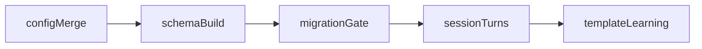
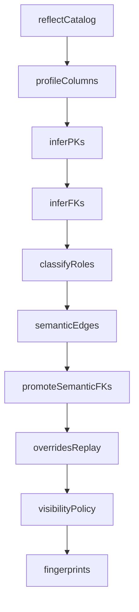
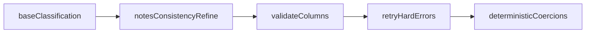
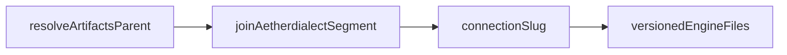
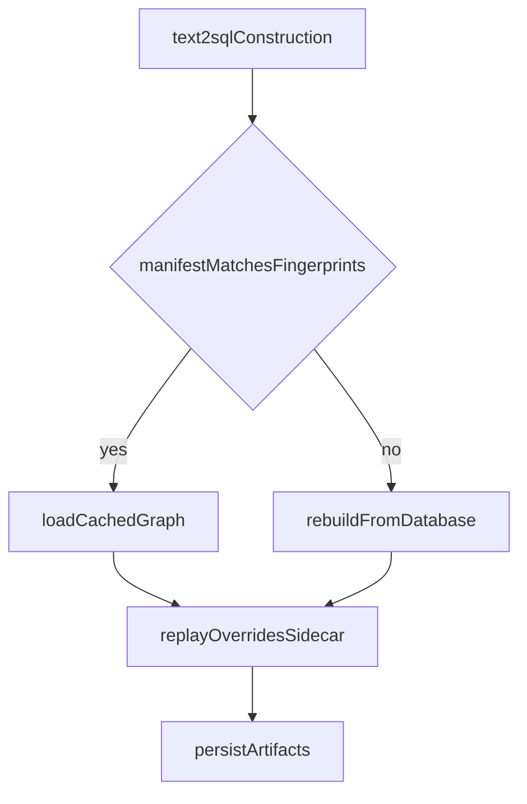
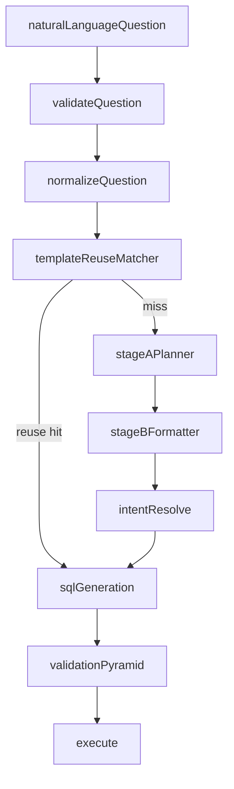
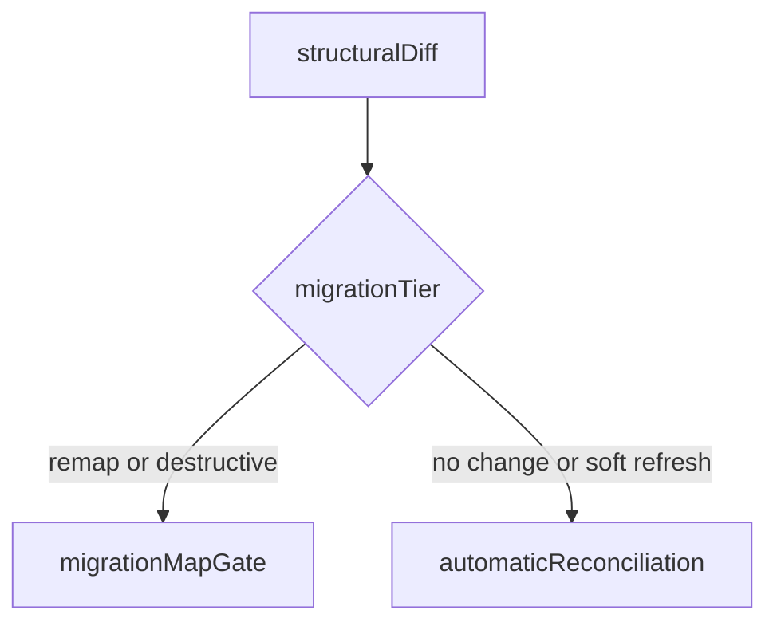
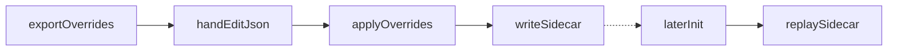
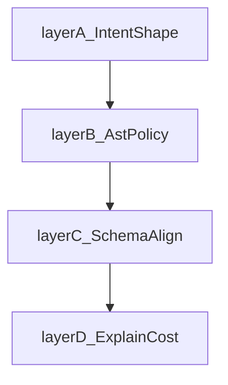
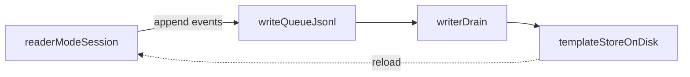

# How it works

This document explains, conceptually, what the engine does between a user's question and a returned table. Public types and signatures are in the [API reference](API_REFERENCE.md). Diagrams require a Mermaid-capable preview.

The core idea is unchanged across every entry point: we prefer reuse and rules over open-ended generation. Each turn is a sequence of cheap checks, and the language model is asked to do small, bounded jobs under deterministic constraints set by the schema graph and the validators.

## Overview

### Document map

| Doc                                     | Role relative to this file                                                                                |
| --------------------------------------- | --------------------------------------------------------------------------------------------------------- |
| [User guide](USER_GUIDE.md)             | Operator setup: credentials, scope, notes, overrides, migration workflow, warmup entry points.            |
| [Integrator guide](INTEGRATOR_GUIDE.md) | Embedding: sessions, threading, reader/writer queue, diagnostics hooks.                                   |
| [API reference](API_REFERENCE.md)       | Every public type, constructor argument, config key, JSON artefact shape, exception, and diagnostic code. |
| [Security](SECURITY.md)                 | Threat model, what reaches the LLM, profiling and persistence boundaries.                                 |
| [Support matrix](SUPPORT_MATRIX.md)     | Per-dialect IR coverage and reformulation rules.                                                          |

Read this file when you need the **conceptual spine**: how schema compilation, storage, migration, overrides, the question pipeline, validation, learning, and configuration fit together.

### End-to-end lifecycle

At a high level: **construct** `Text2SQL` (load or build `SchemaGraph`, replay overrides, reconcile templates against migration tier) → optional **warmup or QSim** (populate or exercise paths without full interactive learning where configured) → **session turns** (`ask` / `step`) that run validation-first pipeline stages → **execution** only after validators pass → **learning** (template accept/reject, write queue in reader mode) persisted under the engine storage directory. Structural catalog drift stops construction with `MigrationPendingError` until you edit `schema_migration_map.json`.

## 1. Schema build pipeline

When a `Text2SQL` instance is constructed, the engine compiles a schema graph from the live database. The graph is built once per fingerprint and cached on disk so subsequent runs start fast. The same graph drives every later question.

Clarifications:

- **Profiling** is the only layer that runs read queries against your live data. It does not ship raw row dumps to LLM prompts. Distinct-value samples in `top_k_values` follow ascending value order from the database (engine-native ordering per type), capped by policy, before any classifier merge. For disclosure about profiling-related behaviour, see [SECURITY](SECURITY.md).
- **PK inference** does not promote a column unless its sample-or-exact distinct count equals row count, nulls are zero, the type is plausible, and the table has at least `INFERRED_PK_MIN_ROW_COUNT` rows.
- **FK inference** is pair-targeted. Candidates are evaluated per table (including self-FKs) and per pair of tables in different connectivity components, using name suffix match, type and cardinality compatibility, and a value-overlap floor against a block list.
- **Semantic edges** — see the verbatim paragraph under [§7 Learning model](#7-learning-model-templates-fuzzy-matching-trust-feedback-write-queue).
- **Visibility** is computed last. A column the LLM may see is one that survives usability (not constant, not overwhelmingly null, not sentinel-dominated), deny lists from `SchemaContext`, and sensitivity rules (`pii` tiers vs `restricted`); details are in [SECURITY § Sensitivity](SECURITY.md).
- **Always-on second-pass classification** — After the base profiling-aware classification LLM call, the engine always runs a second LLM merge pass over that JSON. If `SchemaContext.notes_file` is non-empty, the second pass is **notes-aware**: domain notes can adjust roles, descriptions, and set `pii` only where notes are explicit. If notes are absent, the second pass is **cross-table consistency refinement** only (for example aligning roles for same-named columns across tables); it does not infer sensitivity from names alone.

The output is a frozen `SchemaGraph` plus a manifest with six fingerprints. The next run loads from the cache when the manifest still matches the live database.

## 2. Engine storage and artifact lifecycle

All persisted engine state for a database connection lives under an **engine storage directory** derived from a stable **connection slug** (host, port, database, schema for PostgreSQL; hostname label, catalog, and schema for Databricks).

When **`artifacts_dir`** is omitted, the parent directory is `platformdirs.user_data_dir("aetherdialect")`. When **`artifacts_dir`** is set, the parent directory is its absolute expanded path. In both cases the engine storage directory is `join(parent, "aetherdialect", connection_slug)`.

Production deployments should pass an explicit **`artifacts_dir`** on stable attached storage: the default platform user-data root can differ across hosts or images.

Learning templates are stored under `intent_templates/` inside the engine storage directory:

- **`header.json.gz`** — loaded eagerly on construction. Holds partition map (which shard owns which template id), question-feedback index, union-family buckets, intent-key buckets, and structural indexes used for reuse matching.
- **`partition_<NN>.json.gz`** — up to 256 shards; full template payloads load on demand when a match or write targets an id in that partition.

The template store key is **`effective_structural_hash`** (`sha256(structural_hash + "|" + scope_hash)`). Reader sessions reload the header and affected partitions when the on-disk manifest drifts from the in-memory graph.

On each `Text2SQL` construction the engine compares manifest fingerprints to the live graph. When fingerprints still match, the cached schema graph loads; otherwise the graph is rebuilt and versioned artifacts are updated under the same directory.

Migration tier handling and template-store reconciliation run alongside this path but are summarised in [§4](#4-migration-and-schema_migration_mapjson).

Six fingerprints control reuse:

- `structural_hash` — DDL-stable shape (tables, columns, declared PK/FK).
- `scope_hash` — `SchemaContext.allow_objects`, `deny_columns`, `allow_columns`, `include`, plus inline DDL or notes-file SHA.
- `effective_structural_hash = sha256(structural_hash + "|" + scope_hash)` — the template-store key.
- `profiling_hash` — sample-derived distinct/null counts and inferred semantic payloads.
- `notes_hash` and `semantic_edges_hash` — independent fingerprints for notes-only refresh and semantic-edge drift.

Editing notes therefore does not change `effective_structural_hash`; it triggers a notes-only soft refresh rather than invalidating templates.

## 3. From a question to a SQL answer

Turn order for a single question: validate and normalise the text; run trusted template and fuzzy reuse checks; when no safe short-circuit applies, Stage A planner then Stage B formatter emit structured intent; deterministic resolve plus SQL generation build parameterised SQL (join-choice and semantic-edge LLM calls occur inside resolve when needed); the validation pyramid runs; successful validation executes against the engine.

When a caller supplies the optional runtime-intent snapshot together with persisted `union_family_index` and `intent_key` indexes on the template store, the engine intersects union-family buckets (body fingerprint plus `body|join` composite) with the intent-key bucket before scanning trusted `value_history` for a fuzzy token match. When that intersection is empty, the matcher falls back to the coarse path already used for performance: shape-form index plus question-token neighbours, then the same fuzzy history matcher.

In the SQL phase, the LLM is consulted only for join choice when join-path ambiguity exists, for semantic-edge selection in disconnected table subsets, and (when a question matched a stored template fuzzily but not exactly) for parameter extraction. Bound `:p` and `:s` slots in the generated SQL come from the intent's parameter values, the template's structural defaults, or the fuzzy-reuse parameter extraction call. No LLM ever produces a raw SQL string.

Exact `q_norm` matches reuse the stored SQL with zero LLM calls in the matching path. Token-multiset matches within `PolicyConfig.FUZZY_MATCH_MAX_DISTANCE = 2` summed Levenshtein use exactly one LLM call to extract bound parameters for the new question wording.

When no template short-circuits the turn, the engine asks the LLM for structured intent (planner then formatter), then runs a deterministic repair chain (JSON shape, schema references, types, grain, join reachability). Joins are resolved over precomputed FK paths; ties can invoke a small join-choice helper. Validation layers run before execution (see [§6](#6-validation-pyramid)).

## 4. Migration and `schema_migration_map.json`

On each construction the engine compares the live graph and manifest fingerprints to the **last persisted manifest snapshot** (when present) and computes a **structural diff** (added/dropped tables and columns, renames, value-type changes). That diff feeds **tier classification** and **automatic reconciliation** when no human confirmation is required.

### Four tiers

| Tier             | Meaning (simplified)                                                                                                                                                                                                                                                          |
| ---------------- | ----------------------------------------------------------------------------------------------------------------------------------------------------------------------------------------------------------------------------------------------------------------------------- |
| **NO_CHANGE**    | Stored manifest matches the live graph; templates and caches stay as-is.                                                                                                                                                                                                      |
| **SOFT_REFRESH** | Same effective structural identity but metadata drift (notes, semantic edges, or profiling within overlap bounds). Manifest fingerprints are re-stamped; templates usually stay.                                                                                              |
| **REMAP**        | Scope is unchanged and the engine can reconcile identifiers. Requires operator confirmation via `schema_migration_map.json` before init completes.                                                                                                                            |
| **DESTRUCTIVE**  | Learning reset territory: incompatible artifact format, package version below the manifest minimum, or structural change that cannot be expressed as a safe remap—templates and simulation caches are wiped after you confirm. Also gated behind `schema_migration_map.json`. |

When classification says **REMAP** or **DESTRUCTIVE**, construction writes **`schema_migration_map.json`** in the **process working directory** with pre-filled rename lists and diff-derived drops and additions, then raises **`MigrationPendingError`**. You edit the file, set **`action`** to **`remap`**, **`destructive`**, or **`abort`**, save, and construct again. **`abort`** removes the map and stops init. **`remap`** applies rename migration to the template store, surgical invalidation for drops you kept, migrates override sidecar paths when qualified names change, re-stamps the manifest, and archives the editor file to **`schema_migration_map.applied.json`**. **`destructive`** clears templates and simulation caches, re-stamps the manifest, and reconciles the overrides sidecar.

When classification is **NO_CHANGE** or **SOFT_REFRESH**, migration policy runs **without** a map file: fingerprints update and diff-driven passes may rename template identifiers, surgically drop template rows, and fix value-type changes.

**Across every tier the overrides sidecar is preserved** relative to the new graph; only destructive resets explicitly prune sidecar paths that no longer exist after catalog drift.

## 5. Override replay lifecycle

`schema_overrides.json` is the user-editable surface for correcting the engine without forking it.

The sidecar is replayed on every subsequent build path when `source_schema_hash` or `metadata_hash` differs from the live graph. See [API reference](API_REFERENCE.md) for archival filenames.

## 6. Validation pyramid

Validation is ordered by call graph. Each layer produces structured intent issues or SQL diagnostics (surfaced on `SessionStep.diagnostics` for integrators).

### Deterministic repair (before and between layers)

Before Layer A, and again after formatter output, deterministic repair passes run without LLM calls:

- **Reference normalisation** — resolve ambiguous or unknown table/column tokens against the live graph where rules allow a unique match.
- **Type and grain consistency** — align `SELECT`, `GROUP BY`, and aggregate shapes with declared roles and table grain.
- **Join path repair** — prefer declared and inferred foreign-key paths; join-choice LLM runs only when multiple viable paths remain.
- **Sensitivity repair** — strip non-viable projections or grouping keys when a valid query remains; terminate when `WHERE` / `HAVING` still references forbidden columns (see [User guide — Sensitivity classification](USER_GUIDE.md#sensitivity-classification)).

When logical intent fails schema checks, **Stage A retry** and **Stage B repair** diagnostics may appear; after repair exhaustion a **fresh restart** may run once. Codes are listed in the [API reference — Observability](API_REFERENCE.md#observability).

### Validation layers

**Layer A** enforces the public intent JSON schema and rejects inconsistent CTE projections, malformed alias tokens, and placeholders.

**Layer B** enforces select-only policy and dialect AST validation, rejecting forbidden statement classes, unbound parameters, and parse failures.

**Layer C** aligns identifiers and grains with the compiled schema graph, including join reachability and column visibility rules.

**Layer D** runs dialect `EXPLAIN` (when configured) and cost guardrails before execution. Soft EXPLAIN codes (for example `explain_seq_scan_indexed`, `explain_zero_estimate`) reduce confidence without failing the turn; hard codes fail validation. See [Security](SECURITY.md).

## 7. Learning model (templates, fuzzy matching, trust, feedback, write queue)

Trusted templates short-circuit parsing when reuse gates pass. Fuzzy reuse is described in [§3](#3-from-a-question-to-a-sql-answer). Negative feedback is summarised into bounded failure categories and used only inside guarded retry and template paths.

Semantic edges are fallbacks. They are introduced only when the operator explicitly adds them through overrides, or when FK inference cannot connect two table subsets that end up in the same query. The planner first prefers declared and inferred foreign keys; semantic edges enter the candidate set only when no FK path exists between two required tables.

Reader/writer split: a **reader** session can run with learning mutations deferred. It appends structured **`WriteQueueEvent`** records to `write_queue.jsonl` under the engine storage directory. A **writer** session drains that file automatically at the start of each writer turn (under the same per-instance writer lock as interactive SQL generation) and applies learning mutations (template accept or reject, override proposal materialisation, question feedback). Reader sessions re-check `artifact_manifest.json` at each turn start and reload the partitioned template store plus replay overrides when the manifest’s effective structural hash drifts from the in-memory graph. The file format is stable JSON lines.

Event kinds: `template_accept`, `template_reject`, `paraphrase_emit`, `override_proposal`, `feedback_record` (see `WriteQueueEvent` in the package contracts).

## 8. Determinism

The pipeline is deterministic around model calls; prompts, repair rules, validation, template reuse, and artifact handling are deterministic for a fixed schema, fixed artifacts, fixed configuration, and fixed model behaviour. LLM providers may still change model behaviour over time. When a question matches a trusted template on the auto-accept path, SQL is bit-identical across runs because that path avoids parser and formatter LLM calls.

## 9. Configuration

Effective settings are built for each process without mutating `os.environ`. When **`config_file` is omitted**, the mapping is a string copy of the environment. When **`config_file` is provided**, each flattened field that appears in the file is authoritative for its mapped environment key (non-empty values replace the environment copy; empty values remove that key so shell defaults cannot leak past an explicit empty assignment); keys for fields absent from the file still come from `os.environ`. When multiple engines or LLM stacks are configured, disambiguation uses `[engine] selected`, `[llm] provider`, or the `AETHERDIALECT_*` environment keys.

That merged map drives database connection, LLM provider selection, timeouts, validation toggles, and execution limits. The exact key names, flattening rules, and diagnostic emitted when a TOML value overrides an environment variable are documented in the [API reference — Configuration merge order](API_REFERENCE.md#configuration-merge-order). Operators should treat the merged map as sensitive: it contains credentials when present.

## 10. Simulation, seed warmup, and dry-run warmup

**QSim** (`Text2SQL.run_qsim`) synthesises structured intent skeletons from the compiled graph, instantiates bounded random parameters, asks the LLM to turn those intents into natural-language questions, and writes versioned `qsim_questions_v*.txt` plus `qsim_summary.json` under the engine storage directory. It is a development and stress tool: it exercises schema coverage and template matching without pretending to be user traffic.

**Seed warmup** paths (`run_seed_warmup`, SQL-history warmup, query-log warmup) drive real or reverse-engineered questions through the same validation and execution gates as production, then persist learning when not in dry-run mode. **`dry_run_warmup`** runs the seed-question file in **preflight** mode: validation and execution checks still run, but the seed path skips question-side LLM work and does **not** persist new templates — useful for CI smoke checks where you still want database-backed validation. Details and operator knobs are in the [User guide — Seed warmup](USER_GUIDE.md#seed-warmup).

## 11. Observability

Embedding contracts are in the [Integrator guide — Observability](INTEGRATOR_GUIDE.md#observability). Type fields and code catalogs are in the [API reference — Observability](API_REFERENCE.md#observability).

---

**See also:** [User guide](USER_GUIDE.md) · [Integrator guide](INTEGRATOR_GUIDE.md) · [API reference](API_REFERENCE.md) · [Support matrix](SUPPORT_MATRIX.md) · [Security](SECURITY.md) · [README](../README.md)
