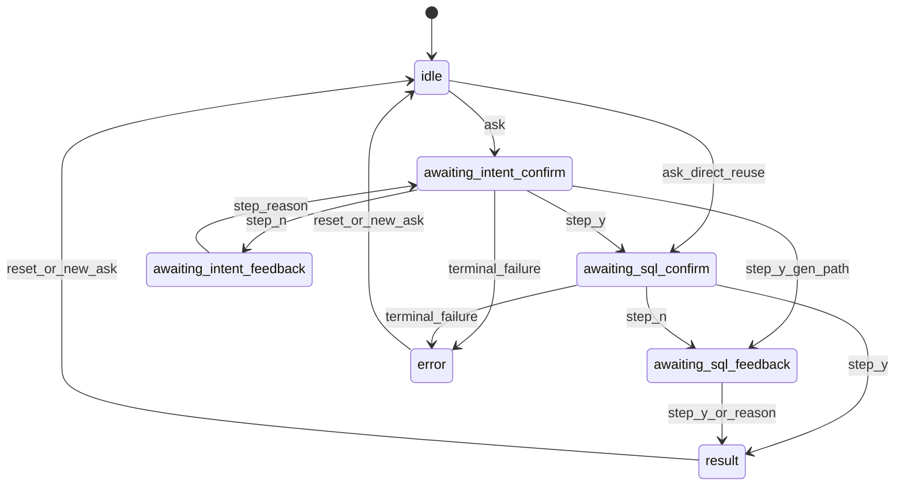
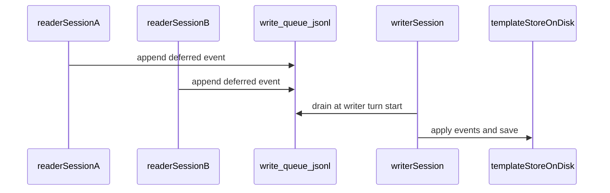

# Integrator guide

This guide is for engineers embedding `aetherdialect` in a service, job runner, notebook, or automation. Stable programmatic surfaces are `Text2SQL`, `PipelineSession`, and `AsyncPipelineSession`.

**Navigation:** [User guide](USER_GUIDE.md) · [API reference](API_REFERENCE.md) · [How it works](HOW_IT_WORKS.md) · [Offline testing and mock LLM (design)](OFFLINE_AND_MOCK_LLM.md) · [Security](SECURITY.md) · [Support matrix](SUPPORT_MATRIX.md)

Diagrams in this guide require a Mermaid-capable preview (editor preview or a Mermaid extension).

Analyst-facing setup and migration are in the [User guide](USER_GUIDE.md). Types, configuration keys, JSON shapes, and method tables are in the [API reference](API_REFERENCE.md). Architecture is in [How it works](HOW_IT_WORKS.md). The export list is `aetherdialect.__all__` in the [API reference](API_REFERENCE.md).

### Offline and mock LLM testing (design)

Until a first-party **`llm_provider="mock"`** ships, hermetic automation usually **stubs** `llm_chat` / `llm_json` at import boundaries, or uses the repository **`live_tests`** harness with real API keys. See [Offline testing and mock LLM (design)](OFFLINE_AND_MOCK_LLM.md).

## When to embed

Embed when your product owns transport, authentication, persistence, and UI, and you need a bounded text-to-SQL engine that returns structured steps rather than streaming raw model text. Supply one self-contained natural-language `str` per `ask`, render suspend prompts from `SessionStep`, relay answers through `step`, and read SQL plus frames from the terminal step. Rewrite conversational follow-ups into standalone questions before each new `ask`.

## Stable imports

```python
from aetherdialect import (
    Text2SQL,
    PipelineSession,
    AsyncPipelineSession,
    SchemaContext,
    SessionStep,
    Diagnostic,
    AuditEvent,
    ConfigSnapshot,
    SchemaStatsSnapshot,
    SeedWarmupSummarySnapshot,
    QSimSummarySnapshot,
    ConfigError,
    ConnectionError,
    SchemaAccessError,
    SessionActiveError,
    MigrationPendingError,
    RetryableError,
    DatabasePingFailed,
    LlmTransientFailure,
    StatementTimeoutError,
    LlmExecutionConfig,
    RuntimeConfig,
    MigrationPreview,
    __version__,
)
```

## Concepts (define before use)

### SchemaContext

Frozen scope passed to `Text2SQL`: which tables and columns enter the graph, optional notes and SQL files, and deny/allow lists. Field semantics and sensitivity policy are in the [User guide — SchemaContext](USER_GUIDE.md) and [Sensitivity classification](USER_GUIDE.md#sensitivity-classification).

### Configuration

Without `config_file`, settings come from a string copy of `os.environ`. With `config_file`, each mapped TOML field present in the file is authoritative for that key (empty clears inherited env); omitted fields still use `os.environ`. The library never mutates `os.environ` during reads. Keys, aliases, defaults, and required flags are in the [API reference — Configuration](API_REFERENCE.md#configuration).

### Engine storage

Versioned artefacts live under:

`join(<artifacts_parent>, "aetherdialect", <connection_slug>)`

where `<artifacts_parent>` is your expanded `artifacts_dir` or the platform user-data root when omitted. Template header, partition shards, and fingerprints are described in [How it works — Engine storage](HOW_IT_WORKS.md).

### Observability

Three channels answer different questions:

| Channel | What you get | When | Typical use |
| ------- | ------------ | ---- | ----------- |
| **`audit_sink`** | `AuditEvent` rows via **your callback** | Coarse lifecycle (`init`, `ask_begin`, `ask_done`, cache clears, write-queue drain) | Centralised audit log, metrics counters |
| **`SessionStep.diagnostics`** | `tuple[Diagnostic, ...]` on every step | Each `ask` / `step` return | UI detail, support tooling, metrics by code |
| **Exceptions and `step.error`** | Typed failures | Config, migration, busy session, terminal errors | Control flow |

**`audit_sink` is not a boolean.** Pass a function, or omit it (default `None`). The engine does not print audit events unless your callback does.

```python
def audit_sink(ev: AuditEvent) -> None:
    log.info(
        "aetherdialect",
        extra={
            "event_type": ev.event_type,
            "question": ev.question,
            "schema_hash": ev.schema_hash,
            **dict(ev.details),
        },
    )

t2s = Text2SQL(SchemaContext(), artifacts_dir="./data", audit_sink=audit_sink)
```

For turn-level detail, read `step.diagnostics` and terminal `step.sql` / `step.error` — not audit rows. Event types and diagnostic codes are catalogued in the [API reference — Observability](API_REFERENCE.md#observability).

CLI helpers such as `run_interactive` print human text to stdout; services should use `SessionStep.diagnostics` instead.

## Construction

By the time `Text2SQL(...)` returns (unless it raises `ConfigError`, `ConnectionError`, `MigrationPendingError`, or another init failure):

- Configuration is merged per [Configuration](#configuration) above.
- The database engine is `postgresql` or `databricks` from merged settings.
- The schema graph is built or rehydrated when fingerprints match; first run can take noticeable time ([User guide — First run](USER_GUIDE.md)).
- When structural migration requires your decision, the constructor raises `MigrationPendingError` after writing `schema_migration_map.json` ([User guide — Migration](USER_GUIDE.md)).

```python
from aetherdialect import MigrationPendingError, SchemaContext, Text2SQL

try:
    t2s = Text2SQL(SchemaContext(), artifacts_dir="./my_run", config_file="./aetherdialect.toml")
except MigrationPendingError:
    # edit schema_migration_map.json in the working directory, then reconstruct
    t2s = Text2SQL(SchemaContext(), artifacts_dir="./my_run", config_file="./aetherdialect.toml")
```

The constructor does not read stdin. Init status is not replayed on later `SessionStep` objects.

## `SessionStep` fields

| Field | Type | Meaning |
| ----- | ---- | ------- |
| `done` | `bool` | `True` when the turn finished (success or terminal failure). |
| `prompt` | `str` or `None` | Short line before collecting the user reply. |
| `kind` | `str` | Stable suspend or terminal identifier; branch UI on this. |
| `sql` | `str` or `None` | SQL under discussion, or final SQL on success. |
| `data` | `pandas.DataFrame` or `None` | Preview at suspend (up to five rows) or full frame on terminal success. |
| `message` | `str` or `None` | Multi-line body (intent readback, guidance, tips). |
| `error` | `str` or `None` | Terminal failure text. |
| `diagnostics` | `tuple` of `Diagnostic` | Structured rows for this step; forward to observability. |
| `intent_summary` | `IntentSummary` or `None` | Compact intent headline when applicable. |
| `status` | `str` or `None` | Coarse failure category on terminal error steps. |
| `reply_shape` | `"yes_no"`, `"free_text"`, or `None` | Expected shape of the next `step` payload when `done` is `False`. |
| `semantic_warnings` | `tuple` of `str` | Normalised warnings for intent confirmation. |

## Suspend and terminal `kind` values

| `kind` | Meaning | Expected next `step` |
| ------ | ------- | -------------------- |
| `awaiting_intent_confirm` | Intent readback; yes or no before generation continues. | `y` or `n` |
| `awaiting_intent_feedback` | User rejected intent readback; short free-text reason. | Non-empty string |
| `awaiting_sql_confirm` | Stored or generated SQL preview; yes or no. | `y` or `n` |
| `awaiting_sql_feedback` | Post-execution confirm (`yes_no`) or rejection reason (`free_text`). | `y`, `n`, or non-empty reason |
| `result` | Terminal success; read `sql`, `data`, `intent_summary`, `diagnostics`. | None |
| `error` | Terminal failure; read `error`, `status`, `diagnostics`. | None |
| `idle` | `step` without active `ask`; surface `error`. | None until new `ask` |

| Internal `state_id` | Public `kind` |
| ------------------- | ------------- |
| `awaiting_direct_reuse_confirmation` | `awaiting_sql_confirm` |
| `awaiting_intent_confirmation` | `awaiting_intent_confirm` |
| `awaiting_intent_rejection_feedback` | `awaiting_intent_feedback` |
| `awaiting_sql_result_confirmation` | `awaiting_sql_confirm` |
| `awaiting_user_feedback_reject_reason` | `awaiting_sql_feedback` |

Branch UI on public `kind` only, not on internal `state_id` strings.

## `PipelineSession` and `AsyncPipelineSession` methods

| Method | Returns | Contract |
| ------ | ------- | -------- |
| `ask(question: str)` | `SessionStep` | Starts a turn; raises `SessionActiveError` if busy. |
| `ask_until_done(question, *, on_confirm="y" \| "n")` | `SessionStep` | Auto-`step` through yes-or-no suspends; raises on free-text suspends. |
| `step(response=None)` | `SessionStep` | Next answer for the current suspend. |
| `awaiting_prompt()` | `bool` | `True` when input must go to `step`. |
| `reset()` | `None` | Clears suspend state and partial turn state; context manager exit calls this. |

`AsyncPipelineSession` delegates the same methods on worker threads.

## Session state machine



Exact transitions depend on reuse and validation; always branch on `SessionStep.kind`.

## Free-text suspends versus yes or no

Use `reply_shape`: `yes_no` expects `y` or `n`; `free_text` expects a short sentence. Pass user text through `step` unchanged.

## `ask_until_done`

Loops internally through yes-or-no suspends until `done`. Raises `SessionActiveError` on free-text suspends. For rejection reasons or custom copy, use the explicit `ask` / `step` loop below.

## Minimal embedding (sync)

```python
from aetherdialect import SchemaContext, Text2SQL

t2s = Text2SQL(
    SchemaContext(),
    artifacts_dir="./my_run",
    config_file="./aetherdialect.toml",
)

with t2s.session() as session:
    step = session.ask("How many orders did each customer place last quarter?")
    while not step.done:
        if step.kind == "awaiting_sql_confirm":
            reply = input("Run the stored SQL as-is? [y/N]: ").strip() or "n"
        elif step.reply_shape == "yes_no":
            reply = input(step.prompt or "y/n: ").strip()
        else:
            reply = input(step.prompt or "").strip()
        step = session.step(reply)
    if step.error:
        handle_error(step)
    else:
        consume_result(step.sql, step.data)
```

## Complete embedding (all suspend branches)

```python
from aetherdialect import AuditEvent, Diagnostic, SchemaContext, SessionStep, Text2SQL


def render_diagnostics(rows: tuple[Diagnostic, ...]) -> None:
    for d in rows:
        print(f"  [{d.code}] {d.message}")


def prompt_for_step(step: SessionStep) -> str:
    if step.reply_shape == "yes_no":
        return input(step.prompt or "y/n: ").strip()
    return input(step.prompt or "").strip()


def handle_terminal(step: SessionStep) -> None:
    render_diagnostics(step.diagnostics)
    if step.error:
        print("ERROR:", step.error, step.status or "")
        return
    print("SQL:", step.sql)
    if step.data is not None and not step.data.empty:
        print(step.data.to_string(index=False))


def audit_sink(ev: AuditEvent) -> None:
    print(f"AUDIT {ev.event_type} q={ev.question!r} details={dict(ev.details)}")


t2s = Text2SQL(
    SchemaContext(),
    artifacts_dir="./my_run",
    config_file="./aetherdialect.toml",
    audit_sink=audit_sink,
)

with t2s.session() as session:
    step = session.ask("How many orders per customer last quarter?")
    while not step.done:
        if step.message:
            print(step.message)
        if step.sql:
            print("SQL (preview):", step.sql)
        if step.data is not None and not step.data.empty:
            print(step.data.head().to_string(index=False))
        reply = prompt_for_step(step)
        step = session.step(reply)
    handle_terminal(step)

    session.reset()
    step2 = session.ask("List the top five customers by order count.")
    while not step2.done:
        step2 = session.step(prompt_for_step(step2))
    handle_terminal(step2)
```

For unattended yes-or-no-only batch jobs, `ask_until_done(question, on_confirm="y")` is documented in the [API reference](API_REFERENCE.md).

## Minimal embedding (async)

```python
import asyncio

from aetherdialect import SchemaContext, Text2SQL

t2s = Text2SQL(SchemaContext(), artifacts_dir="./my_run", config_file="./aetherdialect.toml")


async def main() -> None:
    async with t2s.asession() as session:
        step = await session.ask("Top 10 customers by revenue last month.")
        while not step.done:
            if step.reply_shape == "yes_no":
                reply = (await asyncio.to_thread(input, step.prompt or "y/n: ")).strip()
            else:
                reply = (await asyncio.to_thread(input, step.prompt or "")).strip()
            step = await session.step(reply)
        if step.error:
            raise RuntimeError(step.error)
        print(step.sql)


asyncio.run(main())
```

## Reader and writer split

- **Writer** (`mode="writer"`, default): one writer session at a time per `Text2SQL`; serialised with a per-instance lock; persists learning to disk.
- **Reader** (`mode="reader"`): may overlap other readers and a writer in-process; defers learning to `write_queue.jsonl` under engine storage.

```python
# Dashboard or read-only API tier
with t2s.session(mode="reader") as reader:
    step = reader.ask("Count active customers")
    while not step.done:
        step = reader.step("y")  # relay from your UI

# Single learning consumer (one process per artifacts_dir recommended)
with t2s.session(mode="writer") as writer:
    step = writer.ask("Count active customers")
    while not step.done:
        step = writer.step("y")
    # writer drains write_queue.jsonl at turn start and applies deferred events
```



After a writer applies queued events, start new reader sessions (or reconstruct `Text2SQL`) so in-memory templates match disk. Do not share one `artifacts_dir` across unsynchronised writer processes.

## Embedding patterns

- **HTTP service** — one `Text2SQL` per process or tenant `artifacts_dir`; map each HTTP session to `PipelineSession` state; POST replies to `step`.
- **Queue worker** — one writer consumer calls `ask` / `step`; dashboards use `mode="reader"`.
- **MCP or tool hosts** — return `SessionStep` fields at each suspend; accept the next user message and call `step`.

---

**See also:** [README](../README.md) · [How it works](HOW_IT_WORKS.md) · [User guide](USER_GUIDE.md) · [Support matrix](SUPPORT_MATRIX.md) · [Security](SECURITY.md) · [API reference](API_REFERENCE.md)
